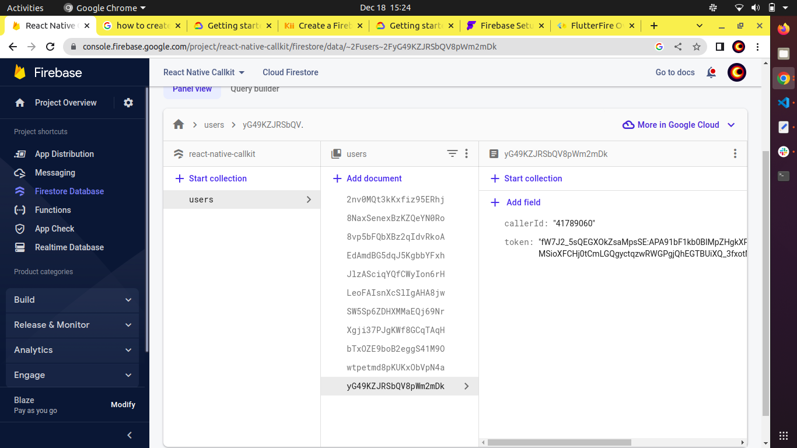
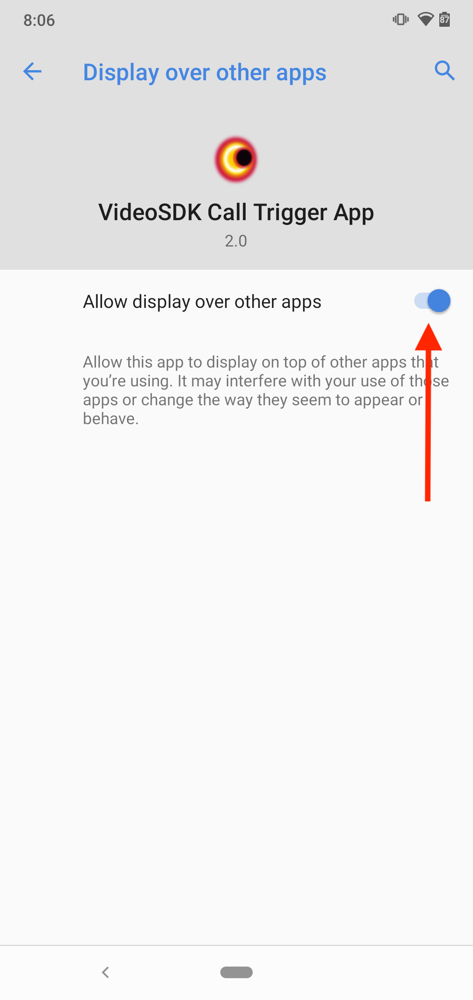
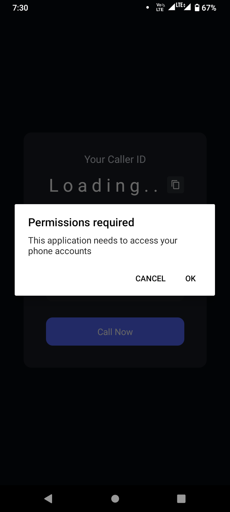
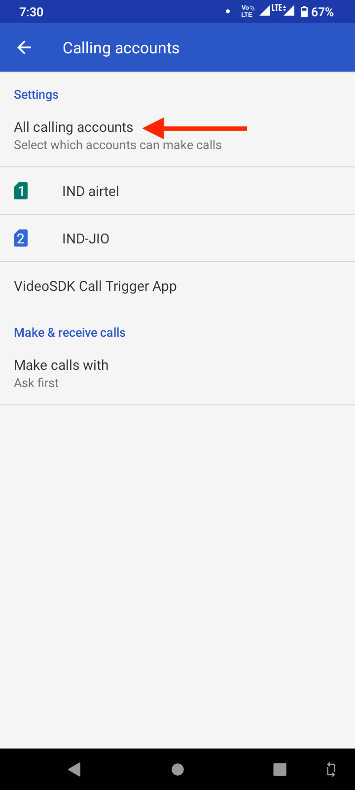
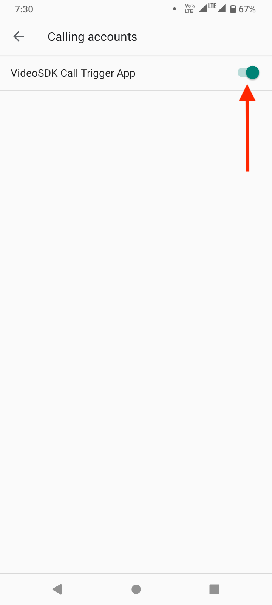
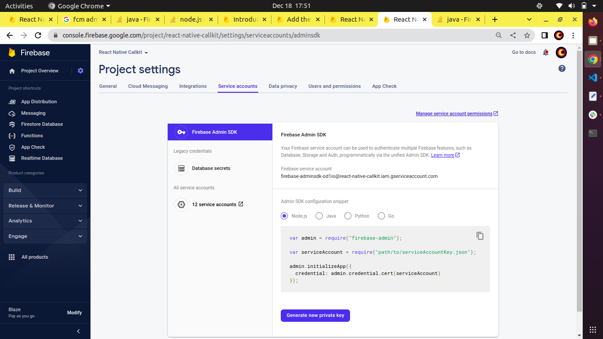

# React native Call Trigger with VideoSDK

## Demo App

📲 Download the Sample iOS app here: _COMING SOON_

📱 Download the Sample Android app here: https://appdistribution.firebase.google.com/pub/i/4dc3b7d23902052c

<br/>

Before continuing, let's keep an eye on the third-party libraries used in this repository.

1. [React Native CallKeep](https://www.npmjs.com/package/react-native-callkeep)
2. [React Native VoIP Push Notification](https://www.npmjs.com/package/react-native-voip-push-notification)
3. [VideoSDK RN Android Overlay Permission](https://www.npmjs.com/package/videosdk-rn-android-overlay-permission)
4. [React Native Firebase - Messaging](https://rnfirebase.io/messaging/usage)
5. [React Native Firebase - Firestore](https://rnfirebase.io/firestore/usage)

⚠️ CallKit(iOS) and ConnectionService(Android) are only available on real devices, this app will not work on simulators.

## Client

### Step 1: Clone the sample project

Clone the repository to your local environment.

```js
https://github.com/videosdk-live/videosdk-rtc-react-native-call-trigger-example.git
```

### Step 2: Go to client folder

```js
cd client
```

### Step 3: Copy the .env.example file to .env file

Open your favorite code editor and copy `.env.example` to `.env` file.

```js
cp.env.example.env;
```

### Step 4: Modify .env file

Generate temporary token from [Video SDK Account](https://app.videosdk.live/signup) and add it to `.env` file.

```js title=".env"
REACT_APP_VIDEOSDK_TOKEN = "TEMPORARY-TOKEN";
```

## iOS Setup

Please follow the guidance of [iOS setup](./iOS_SETUP.md)

### Step 1: Install packages and install pods

```js
npm install
```

```js
cd ios && pod install
```

### Step 2: Run the application

```js
npm run ios
```

## Android Setup

### Step 1: Setup Firebase

#### FCM setup

- Replace your firebase app `google-services.json` file at `/android/app/google-services.json`

#### Firestore setup

- Create web app in your firebase project and replace configuration at `client/database/firebaseDb.js`
- Add `users` collection in firestore database.



### Step 2: Install packages and run the project

```js
npm install
```

```js
npm run android
```

### Step 3: Allow calling and overlay permissions

After successfully installing the app, app will ask `Display over other apps` and `Access phone accounts` permission.

For an app to handle calls in a dead or background state, both permissions are required.

### 1. Display over other apps permission

#### Xiomi device


<!-- <p float="left">
  
   
</p> -->

#### Other device



### 2. Access phone accounts permission



Now, different device have different ways to allow call account permissions.

#### Xiomi device


#### Other device



Click on `All calling accounts` and allow the app to receive call.



_**NOTE : It is necesary to setup local server before run the project.**_

## Server Setup

### Step 1: Go to server folder

```js
cd server
```

### Step 2: Setup Firebase Admin SDK for managing FCM

Download private Key from firebase and repplace it with `server/serviceAccountKey.json`


### Step 3: Install Package and start server

```js
npm install
```

```js
npm run start
```

### Step 4: Add local server url in client

Add Local server ip address in `client/api/api.js` file.

```js title="api.js"
const FCM_SERVER_URL = "http://192.168.1.10:9000";
```

## Issue

You can generate the issue on [Github](https://github.com/videosdk-live/videosdk-rtc-react-native-call-trigger-example/issues) or ping us on [Discord](https://discord.gg/bsEukaNhrD)

## Other Information

### Tested on Devices

- Samsung
- Xiomi
- Realme
- Oppo

### Upcoming Feature

- Recieves call when app is background
- Recieves call when lock screen - _COMING SOON_
